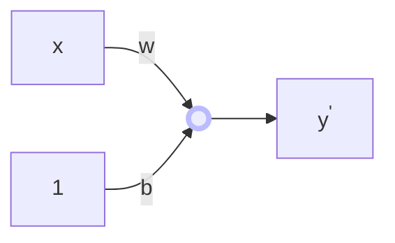

---
{"publish":true,"created":"2025-04-27T22:01:22.140+05:30","tags":["type/zettel","status/done"],"cssclasses":""}
---

> [!Topics]
>
> - [[ml optimizer\|ml optimizer]]

With optimizers like [[SGD with momentum\|SGD with momentum]] and [[nesterov accelerated gradient\|nesterov accelerated gradient]], we are able to adapt our updates to the slope of our error function and speed up [[SGD\|SGD]] in turn. We would also like to adapt our updates to **each individual parameter**, i.e. to perform larger or smaller updates depending on their importance.

### Motivation

Let us consider the dataset which has both **dense** and **sparse** features. During training if learning rate $\eta$ is fixed to some value (say $\eta=0.001$) then training happens with same $\eta$ across the dataset. Due to this, dense features (i.e. weights associated with this feature) will get _faster_ updates while sparse feature will get _slower_ updates. Overall, this leads to slower convergence. This can be undesirable due to the following reasons.

- Many features are irrelevant
- Rare features are often very informative

Adagrad (Adaptive Gradient) is an algorithm for gradient-based optimization that does just this - adapts the learning rate to the parameters, performing smaller updates (i.e. low learning rates) for parameters associated with frequently occurring features, and larger updates (i.e. high learning rates) for parameters associated with infrequent features. For this reason, it is well-suited for sparse data.

### Need for Adaptive learning Rate

Let's say we have a very simple perceptron (with no non-linearity), and a single feature $x$ paired with a single target $y$.

If we compute the derivative of the MSE loss $J$ w.r.t $w$ and $b$ parameters, we get:

$$
\begin{align*}
\frac{\partial{J}}{\partial{w}}&=\frac{\partial{J}}{\partial{y'}}\frac{\partial{y'}}{\partial{w}}=2(y-y')x\\\frac{\partial{J}}{\partial{w}}&=2(y-y')
\end{align*}
$$

One can note the following:

- The derivative w.r.t $w$ has the term $x$
    - If there were several features $x_1, x_2, \ldots$ then we would have corresponding params $w_1, w_2, \ldots$ and $\partial{J}/ \partial{w_i}$ will have the term $x_i$
- If a feature $x_i$ is **sparse**, i.e. mostly zeros, then $\partial{J}/ \partial{w_i}=0$ for most samples
- According to the weight update rule $w=w-\eta\frac{\partial{J}}{ \partial{w}}$, weights corresponding to sparse features will get very few updates, compared to dense features
    - These uneven updates can cause the trajectory of descent to be biased towards the dense feature dimension, thereby slowing convergence

> Intuitively, since the weight updates for the dense feature (say $w_d$) is so frequent, it reaches a good value earlier than others. Now at this point, there is nothing we can do by changing $w_d$ anymore and the only way to reach the minima is to change the value of other $w_i$. Overall this takes more epochs to converge due to this long trajectory taken.

## Idea

We extend the vanilla weight update (using [[gradient descent\|gradient descent]] GD) by adding a decay term to the learning rate, for parameters, in proportion to their update history. Mathematically, for a parameter $w$, we have the new update rule as:

$$
\large\boxed{{\begin{align*}v_t&=v_{t-1}+(\nabla_{w_t}J)^2\\w_{t+1}&=w_t - \frac{\eta}{\sqrt{v_t+\epsilon}}\nabla_{w_t}J \end{align*}}}
$$

where $v_t$ is a _gradient accumulator_, $\epsilon$ is a smoothing term that avoids division by zero (usually on the range from $10^{-4}$ to $10^{−8}$) and other terms mean the same as in regular GD. Interestingly, the square root operation turns out to be very important and without it the algorithm performs much worse.

### Intuition

- For the features which have received a lot of updates, the denominator term $\sqrt{v_t+\epsilon}$ would be high so that the effective learning rate becomes smaller than the learning rate for sparse features (which received few updates)
    - Moreover, for sparse features, the learning rate is also **boosted** when the updates are very small and $v_t<1$
- Another thing to note is that as $t$ increases, $v_t$ increases too as it's an accumulator. This causes a **decaying effect** since we perform division in $\eta / \sqrt{v_t+\epsilon}$. Effectively, this prevents $\eta$ from oveshooting

### Vectorization

Another way to write the equation is as:

$$
\mathbf{w}_{t+1}=\mathbf{w}_t - \frac{\eta}{\sqrt{\text{diag}(G_{t}+\epsilon I)}}\odot\nabla_{\mathbf{w}_t}J
$$

where $\mathbf{w}_t$ is the _vector_ of parameters, $G_t\in{\mathbb{R}^{d\times{d}}}$ is a diagonal matrix where each diagonal element contains the sum of the squares of the gradients w.r.t. $w_i$ up to time step $t$ (like the $v_t$ term seen earlier). With $\text{diag}(\cdot)$, we only take the diagonal elementes in the form of a vector. Also, $\odot$ denotes Hadamard product a.k.a element-wise product between vectors/matrices of same dimension.

**Pros:**

- Well-suited for sparse data
- Eliminates need to manually tune learning rate (default often works)

**Cons:**

- Accumulation of squared gradients causes learning rate to shrink over time, becoming very small. Learning stops too early

## Related
