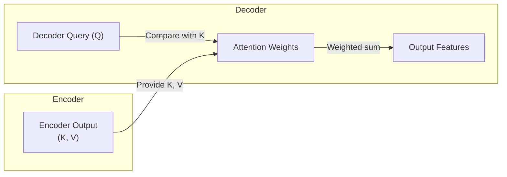

---
{"publish":true,"tags":["type/zettel","status/done"],"PassFrontmatter":true,"created":"2025-04-19T17:56:39.359+05:30"}
---

> [!Topics]
>
> - [[2 Zettels/attention mechanism\|attention mechanism]]
> - [[2 Zettels/encoder-decoder architecture\|encoder-decoder architecture]]
> - [[seq2seq modeling\|seq2seq modeling]]

Cross-attention mechanism connects [[2 Zettels/encoder-decoder architecture\|encoder-decoder architecture]] in standard [[2 Zettels/transformer\|transformer]] models. It's located in each decoder layer.

Allows _decoder_ focus on relevant parts of input sequence processed by encoder when generating output token. Essential for tasks where output depends on different input sequence, such as NMT, summarization, multimodal tasks (image captioning, VQA).

Defining characteristic is source of Q,K,V vectors ([[2 Zettels/key-query-value KQV framework\|key-query-value KQV framework]]):

- **Queries (Q)**: From _decoder_. Derived from output of preceding sub-layer (typically [[masked self-attention\|masked self-attention]]) in decoder block. Represents decoder's current state and information needed from source
- **Keys (K), Values(V)**: From _encoder_. Derived from final output representation of input sequence generated by encoder stack

In [[2 Zettels/scaled dot product attention\|scaled dot product attention]] implementation, use decoder queries and encoder keys/values:

$$
\text{Attention}(Q_{\text{d}}, K_{\text{e}}, V_{\text{e}}) = \text{softmax}\left(\frac{Q_{\text{d}} K_{\text{e}}^T}{\sqrt{d_k}}\right) V_{\text{e}}
$$

This calculation lets decoder find relevant encoded input parts by comparing its query (Q) with encoder keys (K). It then gets a weighted mix of features (V). This is a _dynamic lookup_, where decoder uses its query to look into encoder's output "memory".

## Related
