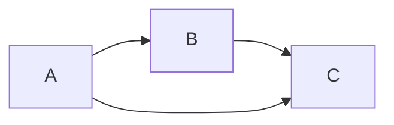

---
{"publish":true,"created":"2025-04-20T12:17:11.970+05:30","tags":["type/zettel","status/done"],"cssclasses":""}
---


> [!Topics]
>
> - [[cycle detection\|cycle detection]]
> - [[graph algorithms\|graph algorithms]]

Directed edges are one-way. Visiting already visited node **doesn't** guarantee cycle. Must be back edge to node _currently in same DFS path_. Here's an example:



In above graph, we will be visiting the node `C` from two different nodes (`B` and `A`), so it will be seen as "already visited" to one of them, yet no cycle.

Detecting cycles in [[directed graphs\|directed graphs]] requires tracking the nodes currently in the recursion path. This can be done using three colors (e.g., white for unvisited, gray for visiting/in recursion stack, black for fully explored) or two boolean arrays (`visited` and `recursion_stack`).

**Algorithm (3 colors):**

- White: unvisited
- Gray: visiting (in recursion stack)
- Black: fully explored
- During DFS, if encounter gray node → cycle detected

```cpp
bool hasCycle(vector<vector<int>>& graph) {
    vector<int> color(graph.size(), 0); // 0=white, 1=gray, 2=black

    function<bool(int)> dfs = [&](int u) {
        color[u] = 1;
        for(int v : graph[u]) {
            if(color[v] == 0 && dfs(v)) return true;
            if(color[v] == 1) return true;
        }
        color[u] = 2;
        return false;
    };

    for(int u = 0; u < graph.size(); ++u)
        if(color[u] == 0 && dfs(u)) return true;
    return false;
}
```

**Algorithm (Recursion stack):**

- Track nodes in current DFS path explicitly using bool array
- If neighbor is in recursion stack → cycle detected
- Uses some extra space compared to the 3 color method

```cpp
bool hasCycle(vector<vector<int>>& graph) {
    vector<bool> visited(graph.size(), false);
    vector<bool> recStack(graph.size(), false);

    function<bool(int)> dfs = [&](int u) {
        visited[u] = true;
        recStack[u] = true;
        for(int v : graph[u]) {
            if(!visited[v] && dfs(v)) return true;
            if(recStack[v]) return true;
        }
        recStack[u] = false;
        return false;
    };

    for(int u = 0; u < graph.size(); ++u)
        if(!visited[u] && dfs(u)) return true;
    return false;
}
```

## Related

- [[2 Zettels/cycle detection in undirected graphs\|cycle detection in undirected graphs]]
