---
{"publish":true,"tags":["type/zettel","status/done"],"PassFrontmatter":true,"created":"2025-04-20T12:46:50.805+05:30"}
---


> [!Topics]
>
> - [[graph algorithms\|graph algorithms]]

Topological sorting produces linear ordering of vertices in a [[directed acyclic graphs\|directed acyclic graphs]] (DAG). For every directed edge $u \rightarrow v$, vertex $u$ comes before vertex $v$ in the ordering.

> [!Warning]
>
> Topological sort only possible for DAGs. Cycles prevent linear ordering.

Common approach uses [[2 Zettels/DFS\|DFS]]. Based on [[post-order traversal\|post-order traversal]].

Perform DFS on graph. When DFS call for vertex `v` finishes (all descendants visited), prepend `v` to result list (or push onto stack). After visiting all nodes, list (or popped stack sequence) yields topological sort.

**Correctness**: Node `u` finishes DFS _after_ all reachable nodes finish. Prepending/pushing reverses dependency order correctly.

```mermaid
graph LR
    A["A"] --> B["B"]
    A --> C["C"]
    B --> D["D"]
    C --> D
```



Possible topological orderings:

- A → B → C → D
- A → C → B → D

### Algorithm Steps

1.  Initialize `visited` set and result list `L` (empty)
2.  For each vertex `u` in graph:
    - If `u` not visited, call `DFS(u)`
3.  Function `DFS(u)`:
    - Mark `u` as visiting
    - For each neighbor `v` of `u`:
        - If `v` marked as visiting, cycle detected (not a DAG). Stop
        - If `v` not visited, call `DFS(v)`
    - Mark `u` as visited (finished)
    - Prepend `u` to `L`
4.  Return `L`

Above algorithm incorporates [[2 Zettels/cycle detection in directed graphs\|cycle detection in directed graphs]] (using 3 color/state approach).

### C++ Implementation (DFS)

```cpp
enum class VisitState { UNVISITED, VISITING, VISITED };

bool dfs(int u,
         const vector<vector<int>>& adj,
         vector<VisitState>& visited,
         vector<int>& result) {

    visited[u] = VisitState::VISITING;

    for (int v : adj[u]) {
        if (visited[v] == VisitState::VISITING) {
            return false; // Cycle detected
        }
        if (visited[v] == VisitState::UNVISITED) {
            if (!dfs(v, adj, visited, result)) {
                return false; // Cycle detected
            }
        }
    }

    visited[u] = VisitState::VISITED;
    result.push_back(u); // Nodes added in reverse order
    return true;
}

vector<int> topological_sort(const vector<vector<int>>& adj) {
    vector<VisitState> visited(adj.size(), VisitState::UNVISITED);
    vector<int> result;
    for (int u = 0; u < adj.size(); ++u) {
        if (visited[u] == VisitState::UNVISITED) {
            if (!dfs(u, adj, visited, result)) {
                return {}; // Cycle detected
            }
        }
    }

    reverse(result.begin(), result.end()); // Reverse to get correct order
    return result;
}
```

**Application:** Topological sort fundamental for dependency/ordering problems:

- Task scheduling
- Course prerequisites
- Build system dependencies

## Related

- [[kahn's algorithm\|kahn's algorithm]] (alternative approach using in-degrees)
